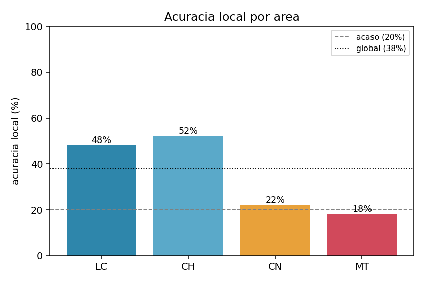
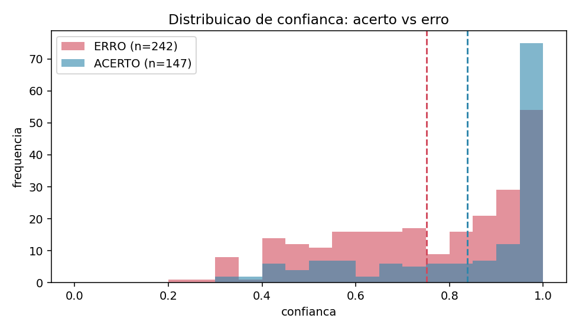
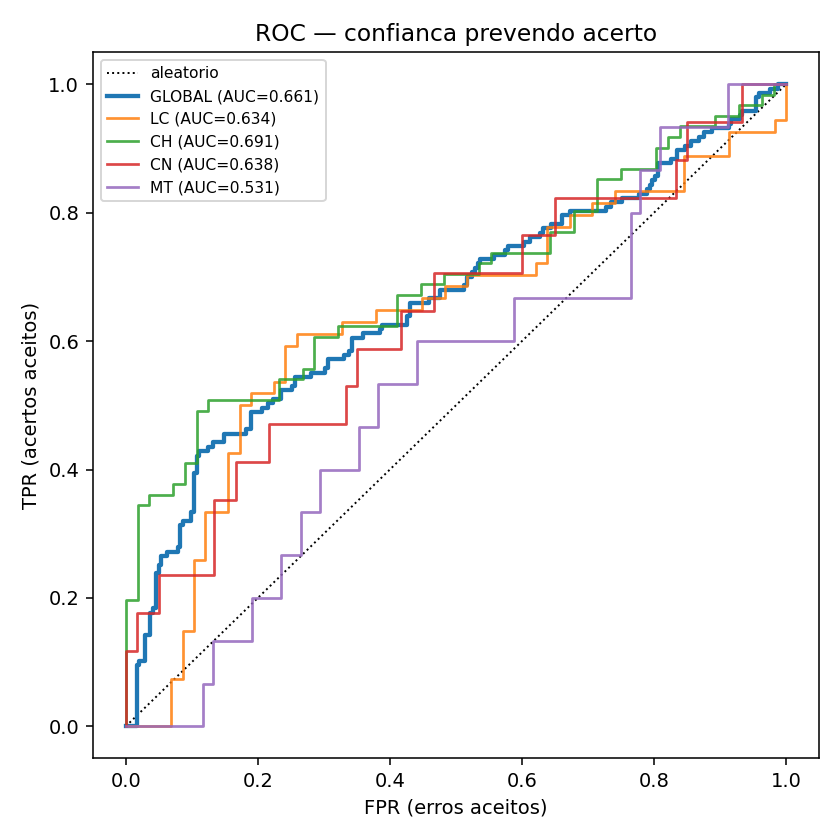
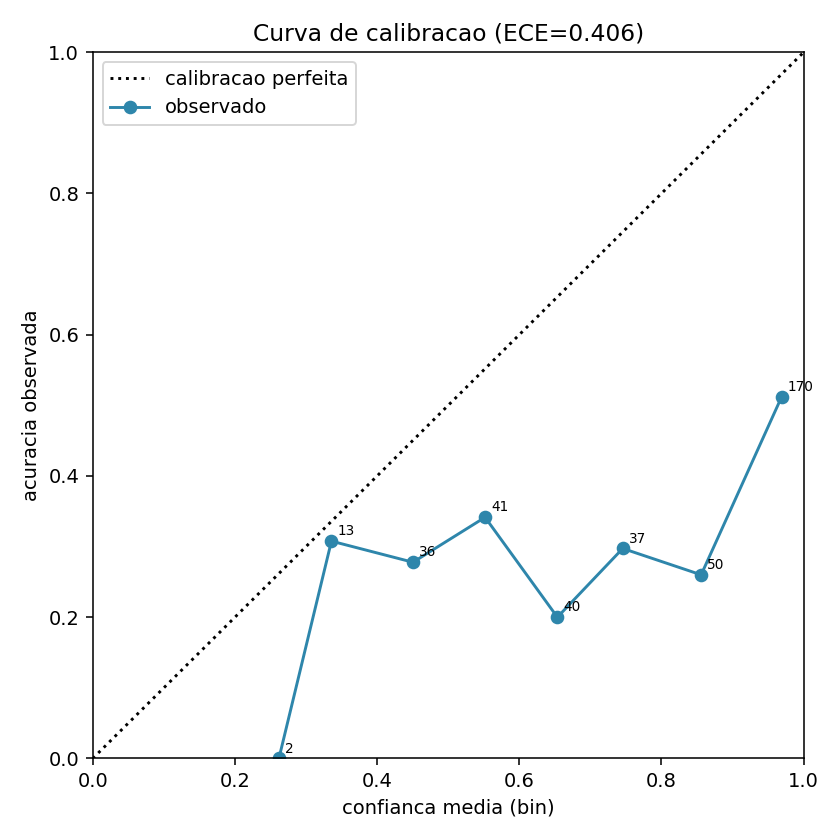
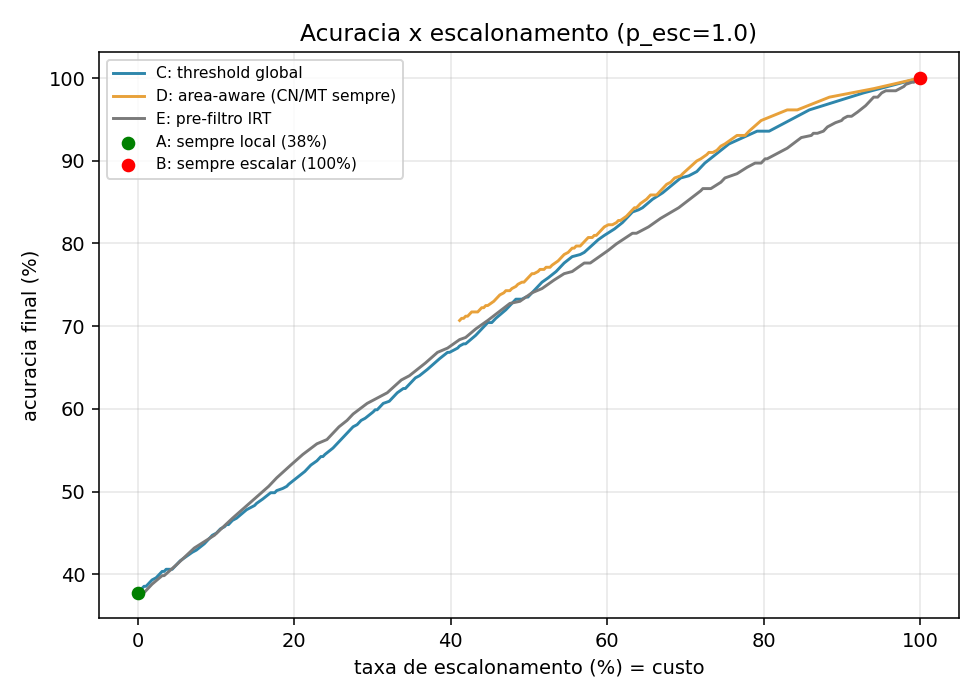
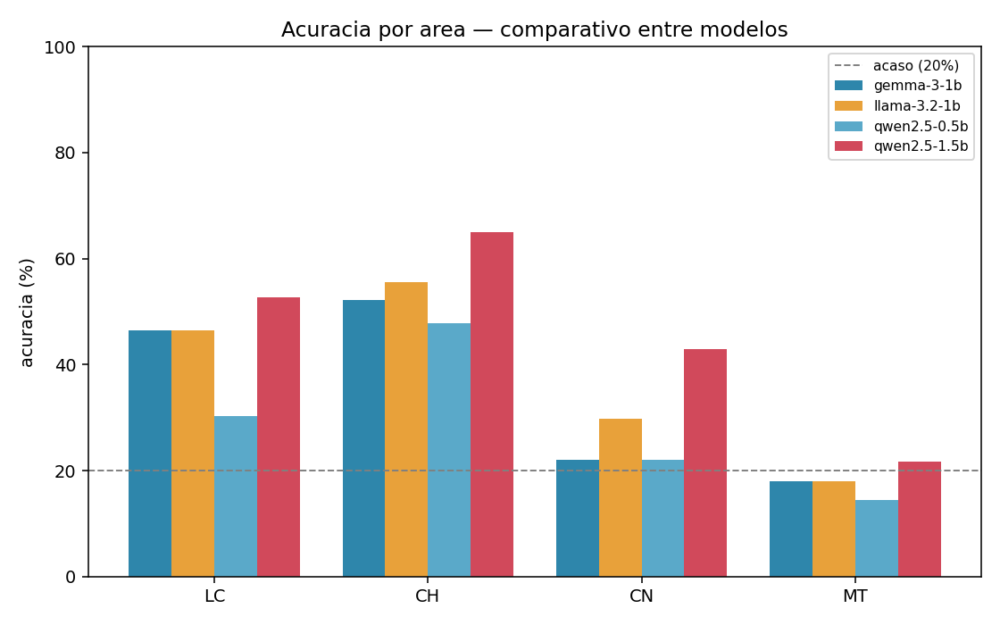
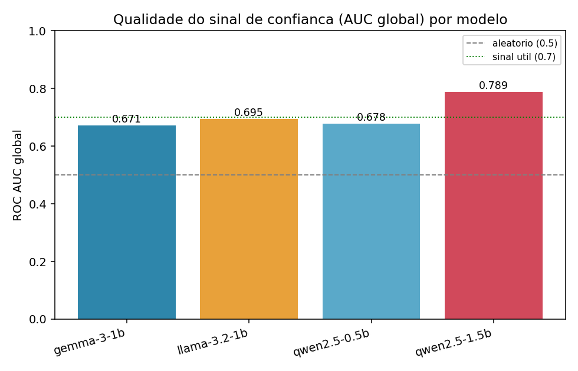

# Validação empírica do sinal de confiança para roteamento elástico de LLMs em educação

> Documento de resultados (seed do Artigo 1). Avaliamos, de forma offline, um modelo local candidato contra questões do ENEM, medindo sua competência e — o ponto central — se a **confiança** que o modelo tem na própria resposta serve para decidir quando "escalar" para um tier mais forte. Escrito para um leitor de ML que não conhece este projeto.

---

## Resumo executivo

Queremos que um app educacional use três "tiers" de modelo (local no celular → servidor na rede da escola → nuvem) e transite entre eles automaticamente, sem desperdiçar recursos.
Para isso testamos a hipótese de que a **confiança do modelo** (derivada dos *logprobs*) diz quando ele acertou. Rodando **Gemma-3-1B** contra **389 questões do ENEM (2022–2024)**, o modelo acertou **37,8%** — bem em Linguagens/Humanas (~50%), no nível do chute em Ciências/Matemática (~20%). A confiança **separa acerto de erro apenas fracamente** (AUC 0,66; nula em Matemática) e é **muito mal calibrada** (o modelo diz "97%" e acerta
51%). A lição para o método de transição: **um limiar único de confiança não basta**; a melhor política simulada combina uma **regra por área** (sempre escalar Ciências/Matemática)
com confiança dentro de Linguagens/Humanas.

Ampliando a avaliação para **quatro modelos locais** no mesmo harness (§5), o quadro muda de forma importante. O **Qwen2.5-1.5B domina** em todos os eixos: maior acurácia (**47,8%**), maior AUC (**0,789** — o único acima de 0,7) e excelente calibração (**ECE 0,064**). E a superconfiança severa do Gemma (ECE 0,41) revela-se **específica dele**, não uma lei dos modelos pequenos: Qwen e Llama são bem calibrados em MCQ (ECE 0,05–0,10). Matemática segue sendo o **calcanhar universal** (AUC ≈ aleatória em todos os modelos), reforçando escalar MT por padrão. Recomendação de pesquisa → produto: o **Qwen2.5-1.5B é o melhor candidato ao tier local**; o **Gemma-3-1B**, fixado nos docs originais, é o **pior** para roteamento por confiança. Por fim, comparando **três sinais de confiança** (logprob vs verbalizada vs P(True); §5.8), o **logprob vence nos dois modelos** — verbalizada e P(True) são piores ou inviáveis de capturar em 1–1,5B, **contrariando** a vantagem da confiança verbalizada relatada por Tian et al. (2023) para modelos grandes: no on-device, fica-se com o logprob.

---

## 1. Motivação: o problema não é ter três modelos, é transitar entre eles

Os trabalhos de *AIED Unplugged* (Papers 901 e 1750) defendem a **elasticidade**: um sistema
educacional com IA deve expandir sua capacidade conforme a infraestrutura disponível — funcionando 100% offline no pior caso, usando um servidor na rede local quando houver, e a
nuvem quando houver internet — **sem degradar** a experiência offline-first. O componente difícil dessa visão não é possuir três modelos; é o **método de transição**: decidir, a cada pergunta do aluno, se o modelo do tier atual já respondeu bem o suficiente ou se vale
"escalar" para um tier mais capaz — **conservando desempenho pedagógico e custo** (energia, latência, conectividade).

Toda essa arquitetura repousa numa hipótese operacional: **a confiança do próprio modelo é um sinal útil para decidir escalar.** Este documento testa essa hipótese empiricamente. Como o tier local de produção (MediaPipe) não expõe os números internos necessários (ver §8), medimos com o `llama.cpp`, que os expõe, num modelo local candidato — obtendo (i) a competência do modelo (acurácia) e (ii) o poder do sinal de confiança para separar acertos
de erros. São exatamente os insumos para calibrar as regras de roteamento.

---

## 2. Dados: por que trocamos de fonte no meio do caminho

Esta seção conta por que a base de questões mudou — uma decisão que afeta a credibilidade de tudo que vem depois.

### 2.1 A fonte inicial (IRT do ENEM) tinha o texto corrompido

A ideia original era usar os microdados do INEP, que trazem, para cada questão do ENEM, um **parâmetro de dificuldade IRT** (*Item Response Theory*): o `NU_PARAM_B`, calibrado sobre
milhões de respondentes. Convertido por uma sigmoide, vira um `difficulty_score ∈ [0,1]`.
O problema apareceu no **enunciado**: o texto vem de extração de PDF e está
**corrompido/desalinhado** — apenas 60 de 545 itens (2022–2024) têm texto com ≥20 palavras utilizáveis, e muitas vezes o texto sequer corresponde ao item certo. O parâmetro de dificuldade continua confiável (é ligado ao item, não ao texto), mas **sem um enunciado limpo não há como montar o prompt** que o modelo responderia.

### 2.2 A base Maritaca resolve o texto — e traz o gabarito

Migramos para a base **`maritaca-ai/enem`** (do repositório `piresramon/gpt-4-enem`), que fornece, para as 180 questões de cada edição (2022–2024): **enunciado limpo, as cinco alternativas (A–E), o gabarito**, um marcador de "precisa de imagem" (`IU`) e descrições
textuais acessíveis das imagens (`description`). Ou seja, ganhamos o que faltava — texto correto e resposta correta —, e o desafio passou a ser **casar** cada questão da Maritaca com a dificuldade IRT da fonte original.

### 2.3 O casamento: join posicional pela cor do caderno

A dificuldade IRT independe da cor do caderno (é do item), mas a **posição** de cada questão muda conforme a cor (o ENEM embaralha a ordem por cor). A Maritaca numera as questões seguindo uma cor específica — que **não é a AMARELA** usada no pipeline IRT. Descobrimos a cor de cada edição por um truque robusto: comparar o **gabarito** (a letra A–E, confiável)
posição a posição, para cada cor, e escolher a de maior concordância.

| Ano | Cor detectada | Concordância de gabarito |
|---|---|---|
| 2022 | VERDE | 97,2% |
| 2023 | VERDE | 95,5% |
| 2024 | ROXA | 97,8% |

Um join ingênuo contra a AMARELA acertaria ~20%; pela cor certa, chega a ~95–98%.

### 2.4 O dataset final

O resultado é `maritaca_enem_irt.csv` com **540 itens**, dos quais **531 (98,3%)** têm ao
mesmo tempo **texto limpo + gabarito + dificuldade IRT** (2022: 174; 2023: 178; 2024: 179);
os 9 restantes são itens anulados sem parâmetro IRT. Destes 531, **389 são de texto puro**
(`IU=false`) — o conjunto que usamos aqui, para não depender de o modelo "enxergar" imagens.

---

## 3. Como medimos: da resposta do modelo ao número de confiança

Esta seção define os conceitos-chave (confiança via *logprobs*) e o protocolo, para que os
resultados sejam interpretáveis.

### 3.1 O harness e o formato da pergunta

O script `evaluate_local_accuracy.py` apresenta cada questão como **múltipla escolha em português**: o enunciado, as cinco alternativas rotuladas A–E, e a instrução de **responder apenas a letra**. A resposta é lida como a primeira letra A–E isolada no texto gerado (casos sem letra contam como erro). Usamos **`temperature = 0`** (geração *greedy*, isto é, o modelo sempre escolhe o token mais provável) para tornar a medição determinística e fazer a confiança refletir a certeza do modelo, não a aleatoriedade da amostragem.

### 3.2 O que é "confiança" aqui, e por que `exp(logprob)`

Um modelo de linguagem, a cada passo, produz uma distribuição de probabilidade sobre o próximo token. Por conveniência numérica, os frameworks retornam o **logaritmo** dessa probabilidade — o *logprob* (um número negativo; quanto mais próximo de 0, mais provável o token). Para voltar à probabilidade em [0,1], basta exponenciar: `prob = exp(logprob)`. Como a nossa resposta é uma única letra, definimos a **confiança da resposta** como a probabilidade que o modelo atribuiu ao **token da letra que ele escolheu** — ex.: se o modelo respondeu "B" com `logprob = −0,04`, a confiança é `exp(−0,04) ≈ 0,96`. É exatamente o método usado no app (via `llama.cpp`), e por isso o `llama.cpp` é necessário: ele expõe esses `logprobs`, ao contrário do MediaPipe.

### 3.3 A virada metodológica: parar de rotular por IRT e passar a rotular por acerto

Aqui está a decisão conceitual mais importante do estudo. A primeira tentativa calibrou os limiares de confiança usando a **dificuldade IRT** como rótulo — a intuição de que "questões difíceis" deveriam ter baixa confiança. **Não funcionou**: a confiança dos itens "fáceis" (mediana ≈ **0,60**) foi praticamente igual à dos "difíceis" (mediana ≈ **0,64**), grupos sobrepostos, e os limiares saíram até invertidos. A razão é conceitual: **o IRT mede dificuldade para humanos**, não para a LLM — uma questão trivial para milhões de vestibulandos pode ser difícil para um modelo de 1B, e vice-versa. Trocamos então o rótulo para o sinal correto: o **acerto do modelo** (comparação com o gabarito). Toda a análise abaixo usa esse rótulo — é a diferença entre perguntar "isto é difícil para gente?" e "este modelo acerta isto?".

---

## 4. Resultados

Modelo avaliado: **Gemma-3-1B-IT Q4_K_M** (quantização de 4 bits), servido via `llama.cpp`. N = **389** questões de texto puro (2022–2024).

### 4.1 Competência: o modelo é fraco, e desigual entre áreas

*O que esta seção responde: o modelo local sabe responder ENEM? E igualmente em toda matéria?* A acurácia global foi **37,8%**. Como cada questão tem cinco alternativas, o **chute aleatório vale 20%** — então o modelo está acima do acaso na média, mas de forma
muito desigual:

| Área | n | Acurácia | Leitura |
|---|---:|---:|---|
| CH (Humanas) | 117 | 52,1% | claramente acima do acaso |
| LC (Linguagens) | 112 | 48,2% | claramente acima do acaso |
| CN (Natureza) | 77 | 22,1% | ≈ chute |
| MT (Matemática) | 83 | 18,1% | ≈ chute |

Isso já sugere, sozinho, uma regra de roteamento: **em Ciências e Matemática o modelo local não agrega** — melhor escalar direto.

*Como ler:* as barras de CN e MT encostam na linha do acaso (20%); LC e CH estão bem acima, próximas ou acima da média global (linha pontilhada).

### 4.2 O sinal de confiança separa acerto de erro? Só um pouco

*O que esta seção responde: dá para confiar na confiança do modelo para decidir escalar?*
Em média, a confiança foi **0,839 nos acertos** e **0,751 nos erros** — uma diferença real, mas pequena. Para quantificar o poder de separação usamos a **AUC** (*Area Under the ROC Curve*): a probabilidade de que um acerto sorteado ao acaso tenha confiança maior que um
erro sorteado ao acaso. **AUC = 0,5** significa sinal inútil (moeda); **1,0** significa separação perfeita; na prática, **0,7 costuma ser o piso do "útil"**.

| Recorte | AUC | Interpretação |
|---|---:|---|
| GLOBAL | 0,661 | sinal fraco-moderado |
| CH | 0,691 | quase "útil" |
| CN | 0,638 | fraco |
| LC | 0,634 | fraco |
| MT | 0,531 | ≈ aleatório |

Ou seja, a confiança ajuda a ordenar respostas em Humanas/Linguagens, mas **em Matemática não carrega informação alguma** (0,53 ≈ 0,5). Consequência direta: uma política baseada *apenas* em confiança tende a falhar justamente onde o modelo é pior.

*Como ler:* as duas distribuições (acerto vs erro) estão largamente **sobrepostas**; as linhas tracejadas (médias) quase coincidem — a assinatura visual de uma AUC baixa.

*Como ler:* quanto mais uma curva "abaula" para o canto superior esquerdo, melhor o sinal; aqui todas ficam próximas da diagonal, e a de MT praticamente colada nela.

### 4.3 Calibração: o modelo é muito mais confiante do que competente
****
*O que esta seção responde: o número de confiança pode ser lido como probabilidade de acerto?* Não. Um modelo **bem calibrado** acerta ~70% das vezes em que diz "70%". Medimos o desvio disso com o **ECE** (*Expected Calibration Error*): a média — ponderada pelo número
de exemplos — da distância entre a confiança declarada e a acurácia real em cada faixa. **ECE = 0** é calibração perfeita; **ECE = 0,406 é muito alto**, e a tabela mostra por quê:

| Faixa de confiança | n | conf. média | acurácia observada |
|---|---:|---:|---:|
| 0,3–0,4 | 13 | 0,336 | 0,308 |
| 0,4–0,5 | 36 | 0,450 | 0,278 |
| 0,5–0,6 | 41 | 0,552 | 0,341 |
| 0,6–0,7 | 40 | 0,654 | 0,200 |
| 0,7–0,8 | 37 | 0,746 | 0,297 |
| 0,8–0,9 | 50 | 0,856 | 0,260 |
| 0,9–1,0 | 170 | 0,969 | 0,512 |

O caso mais gritante: a faixa 0,9–1,0 concentra **170 das 389 questões (44%)** com confiança média **0,969**, mas o modelo só acerta **0,512** delas — uma **superconfiança** enorme. E entre 0,4 e 0,6 a acurácia é praticamente plana (~0,20–0,34), sem subir com a confiança. **Moral:** o valor bruto de confiança **não é** uma probabilidade de acerto; serve, no máximo, como *ordenação* relativa (ranking), não como número absoluto.

*Como ler:* a curva observada fica **muito abaixo** da diagonal (calibração perfeita), especialmente à direita — o modelo promete alto e entrega baixo. Os rótulos indicam quantas questões há em cada ponto.

### 4.4 Confirmando a virada: o IRT prediz mal o comportamento da LLM

*O que esta seção responde: a decisão de abandonar o rótulo IRT (§3.3) se sustenta nos números?* Sim. Medimos a **correlação de Spearman** (correlação entre as *ordenações* de duas variáveis, robusta a relações não-lineares; varia de −1 a +1, e **perto de 0 significa
quase nenhuma relação monotônica**):

- ρ(dificuldade IRT, acerto) = **−0,217**
- ρ(dificuldade IRT, confiança) = **−0,181**

Ambas são fracas e apenas levemente negativas (mais difícil → um pouco menos de acerto, como esperado, mas o efeito é pequeno). Em termos práticos: saber a dificuldade humana de uma questão quase não ajuda a prever se **este** modelo vai acertá-la — exatamente o que motivou trocar o rótulo de calibração.

### 4.5 Simulação de políticas: qual regra de transição rende mais por menos custo

*O que esta seção responde: dado tudo acima, qual método de transição entrega mais acurácia para um dado orçamento de escalonamento?* Modelamos a decisão "aceitar a resposta local vs escalar para um tier mais forte" e medimos **acurácia final × taxa de escalonamento** (a taxa é o custo: quanto mais escalamos, mais rede/energia/latência gastamos). Para isolar
o efeito da *política*, assumimos — de forma explícita e parametrizável — que **escalar equivale a acertar** com probabilidade `p_esc` (o tier superior é forte). Comparamos cinco
políticas:

- **A) sempre local** — 37,8% de acurácia, 0% de escalonamento (o baseline barato);
- **B) sempre escalar** — acurácia `p_esc`, 100% de escalonamento (o baseline caro);
- **C) limiar global de confiança** — escala quando a confiança está abaixo de *t*;
- **D) política área-consciente** — escala **sempre** CN e MT; em LC/CH aplica o limiar de confiança;
- **E) pré-filtro por IRT** — escala quando a dificuldade IRT ≥ θ (o baseline "clássico" do conceito).

A tabela dá a melhor acurácia alcançável dentro de cada orçamento de escalonamento
(`p_esc = 1,0`):

| Orçamento de escalonamento (≤) | C (limiar global) | D (área-consciente) | E (pré-filtro IRT) |
|---|---:|---:|---:|
| 20% | 50,9% @ 19% | — | 53,2% @ 20% |
| 40% | 66,8% @ 40% | — | 67,4% @ 40% |
| 60% | 81,0% @ 60% | **82,0% @ 60%** | 77,6% @ 58% |
| 80% | 93,6% @ 79% | **94,9% @ 80%** | 89,7% @ 80% |

(Com `p_esc = 0,85`, mais realista, o ranking se mantém: em ≤60%, D = 73,1% > C = 72,0% > E = 69,1%.)

A leitura é a seguinte. A política **área-consciente (D) vence** nos orçamentos práticos — em ≤60% de escalonamento chega a 82,0% contra 81,0% da C (ganho de ~1 ponto), e a vantagem persiste em ≤80%. Há uma sutileza importante: D **só existe a partir de ~41%** de escalonamento, porque essa é a fração de questões de CN+MT que ela sempre escala; abaixo disso, só C e E se aplicam. E o pré-filtro IRT (E) apenas empata C em orçamentos baixos e perde no resto — coerente com o IRT ser um sinal fraco (§4.4). Em suma: **gastar o
orçamento de escalonamento primeiro onde o modelo é comprovadamente ruim (Ciências/ Matemática) rende mais do que confiar num limiar de confiança global.**

*Como ler:* o eixo x é o custo (quanto se escala) e o y é a acurácia final; a curva de D fica **acima** da de C na faixa em que ambas existem, e a de E fica por baixo — a distância vertical entre as curvas é o ganho de cada política para o mesmo custo.

---

## 5. Comparação multi-modelo (tier local)

*O que esta seção responde: a confiança fraca e mal calibrada da §4 é uma propriedade **do método** ou **daquele modelo**?* Para separar as duas coisas, rodamos mais três candidatos locais no **mesmo harness** (389 questões de texto puro, `temperature = 0`, `n_predict = 4`): **Qwen2.5-0.5B-Instruct**, **Qwen2.5-1.5B-Instruct** e **Llama-3.2-1B-Instruct** (todos Q4_K_M via `llama.cpp`). A escolha cobre **três famílias** (Gemma, Qwen, Llama) e, dentro do Qwen, **dois tamanhos** (0,5B→1,5B) — exatamente a pergunta PP2 do protocolo multi-modelo. A tabela abaixo é o comparativo oficial (de `comparativo_modelos.csv`):

| Métrica | gemma-3-1b | llama-3.2-1b | qwen2.5-0.5b | qwen2.5-1.5b |
|---|---:|---:|---:|---:|
| Acurácia global | 37,3% | 39,8% | 30,6% | **47,8%** |
| Acurácia LC | 46,4% | 46,4% | 30,4% | **52,7%** |
| Acurácia CH | 52,1% | 55,6% | 47,9% | **65,0%** |
| Acurácia CN | 22,1% | 29,9% | 22,1% | **42,9%** |
| Acurácia MT | 18,1% | 18,1% | 14,5% | **21,7%** |
| Conf. média acerto | 0,845 | 0,592 | 0,408 | 0,548 |
| Conf. média erro | 0,748 | 0,437 | 0,320 | 0,360 |
| AUC global | 0,671 | 0,695 | 0,678 | **0,789** |
| AUC LC | 0,668 | 0,677 | 0,697 | **0,812** |
| AUC CH | 0,691 | 0,745 | 0,668 | **0,787** |
| AUC CN | 0,638 | 0,538 | 0,591 | **0,778** |
| AUC MT | 0,531 | 0,462 | 0,533 | 0,515 |
| ECE | 0,411 | 0,102 | 0,050 | 0,064 |
| Threshold (Youden) | ~0,98 | ~0,55 | ~0,35 | ~0,37 |

*Como ler:* em cada área, as quatro barras são os modelos; o **Qwen2.5-1.5B** (barra mais alta em praticamente toda área) se destaca, enquanto **todas** as barras de MT permanecem coladas na linha do acaso (20%).

### 5.1 O Qwen2.5-1.5B domina em todos os eixos

Não há trade-off a negociar: o **Qwen2.5-1.5B** tem a **maior acurácia** (47,8%), a **maior AUC** (0,789 — o **único** acima do piso de "útil", 0,7), **excelente calibração** (ECE 0,064) e é o **único com sinal aproveitável em Ciências** (AUC CN **0,778**, contra 0,54–0,64 dos demais). Ele vence competência *e* qualidade do sinal ao mesmo tempo.

### 5.2 Efeito de família: a superconfiança severa é do Gemma, não dos modelos pequenos

O **Gemma-3-1B é um outlier de superconfiança**: **ECE 0,411**, contra **0,05–0,10** dos outros três. Isto corrige uma leitura possível da §4: a superconfiança gravíssima **não** é uma lei dos modelos pequenos — **Qwen e Llama, do mesmo porte, são bem calibrados em MCQ**, coerente com a literatura de que modelos pequenos *podem* ser bem calibrados em múltipla escolha. A calibração é, portanto, **propriedade da família/modelo**, não do tamanho por si só.

*Como ler:* só a barra do **Qwen2.5-1.5B** ultrapassa a linha de "sinal útil" (0,7); as outras três ficam na faixa fraca (0,67–0,70). A altura da barra é a qualidade do sinal de confiança para roteamento.

### 5.3 Efeito de tamanho: de 0,5B para 1,5B, competência e sinal sobem juntos

Dentro da **mesma família Qwen**, subir de **0,5B → 1,5B** melhora as duas coisas ao mesmo tempo: acurácia **30,6% → 47,8%** e AUC global **0,678 → 0,789**. Ou seja, mais parâmetros compram **competência e qualidade do sinal de confiança** conjuntamente — não é preciso escolher entre acertar mais e saber quando acertou.

### 5.4 Matemática é o calcanhar universal

Em **MT, a confiança é ~inútil em todos os modelos**: AUC entre **0,46 e 0,53** (≈ aleatório), inclusive no Qwen2.5-1.5B (0,515). Nenhum modelo local "sabe quando errou" em Matemática. Isso **reforça a regra da §4.5**: **escalar MT por padrão**, independentemente do modelo local escolhido.

### 5.5 Os limiares variam por modelo — confiança bruta não é comparável

O threshold de Youden vai de **~0,35 (Qwen 0,5B) a ~0,98 (Gemma)**. Como cada modelo "fala" numa escala de confiança diferente, o **valor bruto de confiança não é comparável entre modelos** — só a **AUC / curva risco-cobertura** são grandezas comparáveis. Na prática, o limiar de roteamento tem de ser **calibrado por modelo**, e não copiado de um modelo para outro.

### 5.6 Reprodutibilidade

A re-execução do **Gemma** reproduziu a 1ª rodada dentro do ruído esperado (acurácia **37,3% vs 37,8%**; AUC **0,671 vs 0,661**; ECE **~0,41** nas duas). Além disso, o **backend não alterou os resultados** (Vulkan/GPU vs CPU) — bom sinal de que os números são estáveis e reproduzíveis, não artefato de hardware.

### 5.7 Recomendação pesquisa → produto

Combinando tudo: o **Qwen2.5-1.5B é o melhor candidato ao tier local**, pois domina **acurácia e qualidade do sinal** simultaneamente. O **Gemma-3-1B** — o modelo fixado nos documentos originais — é, ironicamente, o **pior para roteamento por confiança** (menor AUC útil e superconfiança extrema). A escolha do modelo local deveria, portanto, migrar do Gemma para o Qwen2.5-1.5B, mantendo a regra "escalar CN/MT por padrão" que vale para todos.

### 5.8 Qual sinal de confiança usar? logprob vs verbalizada vs P(True)

*O que esta seção responde: o **logprob** é mesmo o melhor sinal on-device, ou a **confiança verbalizada** / **P(True)** — que a literatura reporta melhores em modelos grandes — o superam nesses modelos pequenos?* Rodamos os **três sinais sobre a mesma resposta**, nas 389 questões de texto puro (`temperature 0`), em dois modelos, via `evaluate_verbalized_confidence.py`. A **verbalizada** pede ao modelo um número 0–100 de confiança; a **P(True)** faz uma 2ª chamada perguntando se a resposta está correta e lê a probabilidade do token "Sim" (Kadavath et al., 2022).

| Modelo | Sinal | AUC | ECE | Capturados (de 389) | Leitura |
|---|---|---:|---:|---:|---|
| **Qwen2.5-1.5B** | **LOGPROB** | **0,793** | **0,071** | 389 | melhor sinal — discrimina e é bem calibrado |
| Qwen2.5-1.5B | Verbalizada | 0,624 | 0,339 | 389 | fraco e superconfiante (conf. acerto 0,853 vs erro 0,741) |
| Qwen2.5-1.5B | P(True) | 0,558 | 0,413 | 389 | ≈ aleatório |
| **Gemma-3-1B** | **LOGPROB** | **0,671** | 0,411 | 389 | melhor sinal (embora mal calibrado) |
| Gemma-3-1B | Verbalizada | 0,575 | 0,515 | 278 | fraco; **111 faltantes** ("sem_numero") |
| Gemma-3-1B | P(True) | 0,452 † | — | **17** | **não interpretável** (captura ínfima) |

† AUC calculada sobre apenas **17/389** respostas capturadas — amostra insuficiente; **não deve ser interpretada** como o poder do sinal.

**1. O logprob vence nos dois modelos.** AUC **0,793** (Qwen) e **0,671** (Gemma) — é o **melhor sinal de confiança on-device**, com folga sobre verbalizada e P(True). No Qwen ele vence também em **calibração** (ECE 0,071, o menor da tabela).

**2. Verbalizada: fraca e superconfiante em ambos.** AUC 0,62 (Qwen) e 0,58 (Gemma), com ECE alto (0,34 e 0,52) — no Qwen a confiança declarada é maior nos acertos (0,853) do que nos erros (0,741), mas separa mal. E, **achado próprio**: no **Gemma** o número de confiança **não é sequer emitido em 28% dos casos** (111/389 "sem_numero") — o modelo pequeno tem dificuldade de **produzir** uma confiança verbalizada no formato pedido, mesmo com chamada dedicada.

**3. P(True): inviável nesses modelos.** No Qwen, com amostra completa, é **quase aleatório** (0,558). No Gemma, só foi **capturável em 17/389** (o modelo raramente responde "Sim/Não" de forma legível na 2ª chamada) — registramos isso como **limitação de captura/método**, não como AUC do modelo.

**4. Nota metodológica (não cravar AUC com amostra pequena).** No passe piloto de 40 questões, o P(True) do Qwen aparentava AUC **0,749**; com as 389, caiu para **0,558**. É um lembrete concreto de que estimativas de AUC em amostras pequenas são instáveis e não devem ser reportadas como conclusivas.

**5. Conclusão — o sinal ótimo depende do tamanho do modelo.** Estes números **contradizem**, no regime on-device (1–1,5B), a vantagem da **confiança verbalizada** relatada por **Tian et al. (EMNLP 2023)** para modelos **grandes** alinhados: aqui o **logprob é o melhor sinal**, e verbalizada/P(True) são piores ou inviáveis de capturar. A escolha do sinal de transição, portanto, **não é universal — depende da escala do modelo**; para o tier local pequeno, fica-se com o logprob.

---

## 6. Discussão e limitações

Vários fatores restringem o alcance destas conclusões, e é importante nomeá-los:

- **A escolha do modelo domina os números.** A análise detalhada da §4 é do Gemma-3-1B-Q4_K_M, mas a §5 mostra que acurácia, AUC, ECE e limiares **variam muito entre modelos** — o Qwen2.5-1.5B, por exemplo, é melhor em **todos** os eixos. Nenhum número absoluto da §4 deve ser generalizado para "o tier local"; ele é do Gemma.
- **Medimos com um *proxy* do tier local.** Usamos `llama.cpp` porque ele expõe *logprobs*, mas o tier local do app roda **MediaPipe**, cujo `generateResponse()` devolve só texto e **não expõe *logprobs*** (ver §8). Logo, a confiança medida é do *runtime substituto*; no app atual ela não seria calculável on-device sem trocar o runtime.
- **A confiança fraca e mal calibrada da §4 é do Gemma — não uma lei dos modelos pequenos.** Para o Gemma, AUC global 0,66, nula em MT, e ECE 0,41. Mas a §5 deixa claro que a **superconfiança severa é específica do Gemma**: Qwen e Llama, do mesmo porte, têm ECE 0,05–0,10 (bem calibrados em MCQ) e AUC até 0,79. A generalização segura é mais estreita: **em MT a confiança é ~inútil em todos os modelos**; fora de MT, a qualidade do sinal **depende fortemente do modelo**.
- **Possível contaminação de treino.** O ENEM é público; o modelo pode tê-lo visto no treino, o que inflaria a competência medida (embora a acurácia baixa sugira contaminação limitada para este modelo).
- **A área é verdade-fundamental.** A política D usa a área correta, conhecida no dataset. Em produção, o app **não sabe** a área da pergunta do aluno; usá-la exigiria seleção na UI ou um classificador de área.
- **"Escalar = acertar" é um teto.** Essa premissa favorece o escalonamento; o ganho real depende da competência efetiva do tier superior.
- **Só texto.** Restringimos a `IU=false`; as 142 questões com imagem do conjunto de ouro não foram avaliadas.

---

## 7. Principais lições

1. **A qualidade do sinal de confiança é propriedade do modelo, não do método.** Entre quatro modelos locais (§5), a AUC global vai de 0,67 a **0,79** e o ECE de **0,05** a **0,41** — logo, "a confiança não presta para roteamento" era uma conclusão sobre o **Gemma**, não sobre a abordagem.
2. **O melhor candidato local é o Qwen2.5-1.5B**, que domina acurácia (47,8%) e sinal (AUC 0,789, ECE 0,064); o **Gemma-3-1B** (fixado nos docs originais) é o **pior** para roteamento por confiança. E **tamanho ajuda**: no Qwen, 0,5B→1,5B eleva acurácia (30,6→47,8%) e AUC (0,68→0,79) juntas.
3. **A área é um sinal forte e barato, e Matemática é o calcanhar universal.** O local fica ~acaso em CN/MT em todos os modelos, e a AUC de MT é ~aleatória (0,46–0,53) para todos — então "sempre escalar CN/MT" vale independentemente do modelo escolhido.
4. **A melhor política é híbrida** (área + confiança dentro de LC/CH) e o **limiar ótimo depende do orçamento** de escalonamento — e, pela §5.5, **é calibrado por modelo** (os limiares vão de ~0,35 a ~0,98): confiança bruta não é comparável entre modelos, só a AUC/curva risco-cobertura.
5. **On-device, o logprob é o melhor sinal de confiança** (§5.8): vence a confiança verbalizada e a P(True) nos dois modelos (AUC 0,79 e 0,67), **contrariando** — na escala 1–1,5B — a vantagem da verbalizada reportada por Tian et al. (2023) para modelos grandes. Verbalizada é fraca/superconfiante (e o Gemma nem sempre emite o número), e P(True) é inviável de capturar nesses modelos. A escolha do sinal **depende do tamanho do modelo**.
6. **Rótulo importa**: dificuldade humana (IRT) ≠ dificuldade para a LLM; calibrar por acerto do modelo é o caminho certo.
7. **O runtime de medição importa**: sem *logprobs* (MediaPipe/Firebase), não há confiança on-device — uma restrição de engenharia que o método de transição precisa contornar.

---

## 8. Nota técnica: por que o tier local (MediaPipe) não dá logprobs

O tier local do app (`MediaPipeLocalInferenceService.generate()`) chama `LlmInferenceSession.generateResponse()`, que retorna **apenas uma `String`** — as opções da API configuram parâmetros de *entrada* (temperatura, top-k, top-p), mas a saída não inclui *logprobs*, logits ou scores por token. Por isso o app **não calcula confiança no tier local** hoje (o roteador registra `confidence = −1`, método `"none"`), e por isso esta avaliação usou `llama.cpp` como substrato de medição. Obter confiança on-device exigiria um runtime que exponha logits (ex.: `llama.cpp` via JNI) — é uma decisão de engenharia separada do resultado de pesquisa.

---

## Apêndice — Reprodutibilidade

- Dataset unificado: `data/maritaca/maritaca_enem_irt.csv` (build: `build_maritaca_irt.py`).
- Avaliação: `data/maritaca/evaluate_local_accuracy.py` → `data/maritaca/resultados_acerto_local.csv`.
- Análise/figuras: `data/maritaca/analyze_accuracy.py` → `data/maritaca/analise/`
  (`metrics_por_area.csv`, `calibracao.csv`, `politicas.csv`, `fig_*.png`, `relatorio.md`).
- **Multi-modelo (§5):** cada modelo é avaliado com `evaluate_local_accuracy.py --model-name <rótulo>`
  (um `llama-server` por vez na mesma porta), gerando `resultados_acerto_<rótulo>.csv`; a
  consolidação é feita por `data/maritaca/aggregate_multimodel.py` →
  `data/maritaca/comparativo_modelos.csv` e `data/maritaca/analise/fig_cmp_acc_area.png`,
  `fig_cmp_auc_global.png`.
- Modelos avaliados (todos Q4_K_M via `llama-server`, `temperature = 0`): **Gemma-3-1B-IT**,
  **Qwen2.5-0.5B-Instruct**, **Qwen2.5-1.5B-Instruct**, **Llama-3.2-1B-Instruct**.
